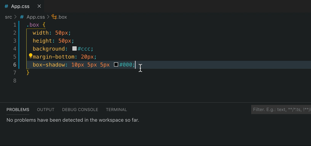

# stylelint-config-react-native-css-modules

[](https://www.npmjs.org/package/stylelint-config-react-native-css-modules)
[](https://travis-ci.org/kristerkari/stylelint-config-react-native-css-modules)
[](https://ci.appveyor.com/project/kristerkari/stylelint-config-react-native-css-modules/branch/master)
[](http://npmcharts.com/compare/stylelint-config-react-native-css-modules?periodLength=30)
[](https://egghead.io/courses/how-to-contribute-to-an-open-source-project-on-github)
[](https://greenkeeper.io/)

Shareable stylelint config for [React Native CSS modules](https://github.com/kristerkari/react-native-css-modules)



## Installation and usage

Install `stylelint-config-react-native-css-modules` (and `stylelint` + `stylelint-react-native`, if you haven't done so yet):

```
yarn add stylelint stylelint-react-native stylelint-config-react-native-css-modules --dev
```

or

```
npm install stylelint stylelint-react-native stylelint-config-react-native-css-modules --save-dev
```

Create the `.stylelintrc` config file (or open the existing one) and extend `stylelint-config-react-native-css-modules` config.

```json
{
  "extends": "stylelint-config-react-native-css-modules",
  "rules": {
    "selector-class-pattern": "^[a-z][a-zA-Z0-9]*$"
  }
}
```

## Config for React Native + Web

By default the config is for React Native only, but if you want to share the styles between React Native and Web, extend the `stylelint-config-react-native-css-modules/web` config instead. This turns some of the errors to warnings to ensure compatibility with Web.

```json
{
  "extends": "stylelint-config-react-native-css-modules/web",
  "rules": {
    "selector-class-pattern": "^[a-z][a-zA-Z0-9]*$"
  }
}
```

If you want to turn off any of the included errors or warnings, set the rule's value to `null`:

```json
{
  "extends": "stylelint-config-react-native-css-modules/web",
  "rules": {
    "react-native/font-weight-no-ignored-values": null
  }
}
```
